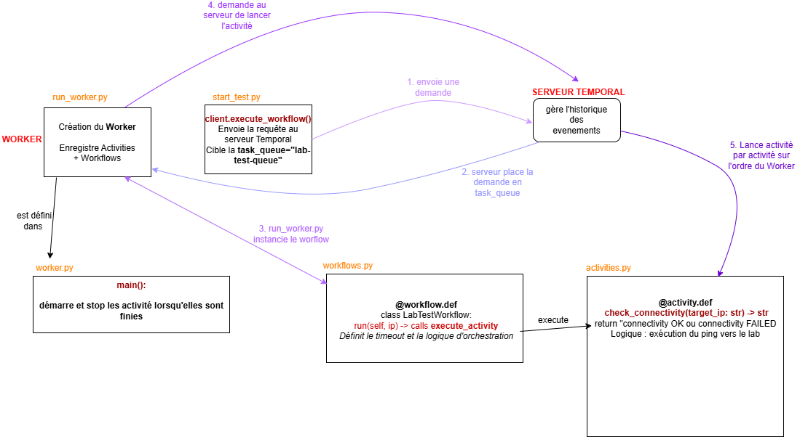

source for network lab : https://github.com/naveenachyuta/naf-temporal-2025/tree/main

# Step by step summary
1) Set up a lab on a Linux VM following :([https://GitHub - naveenachyuta/naf-temporal-2025](https://github.com/naveenachyuta/naf-temporal-2025/tree/main))

2) Install Temporal with python extension : (https://docs.temporal.io/develop/python/set-up-your-local-python)n) , (bc python used for the POC)

Check that the temporal server can be launched : temporal server start-dev

3) Create a workflow and an activity : 
- workflow : defines the sequence of activities and handles the state. Workflows are  deterministic (no variables, all external interactions must go through activities).
```
from datetime import timedelta
from temporalio import workflow

# Import your activity
with workflow.unsafe.imports_passed_through():
    from activities import configure_interface

@workflow.def
class NetworkProvisioningWorkflow:
    @workflow.run
    async def run(self, interface: str) -> str:
        # Executes the activity with a timeout policy
        return await workflow.execute_activity(
            configure_interface,
            interface,
            start_to_close_timeout=timedelta(seconds=10)
        )
```

- activity : on node of the workflow : coded function that performs a single&specific task (like configuring a router, sending an API call, or querying a DB). They are designed to be retried automatically if they fail.
Template : 
```
from temporalio import activity

@activity.def
async def configure_interface(interface_name: str) -> str:
    # Logic to interact with Nokia SR Linux would go here
    return f"Interface {interface_name} configured successfully!"
```

4) Run the POC by creating a worker : process that polls the Temporal Server for tasks and executes your code.
- Start the Worker by creating a `run_worker.py` script to register your Workflows/Activities.
- Trigger the Workflow: Use a `start_workflow.py` script or the Temporal CLI to start the process.


Notes : 
temporal is available with a wide range of languages  python, ruby, java, php … as long as the correct extension is installed



